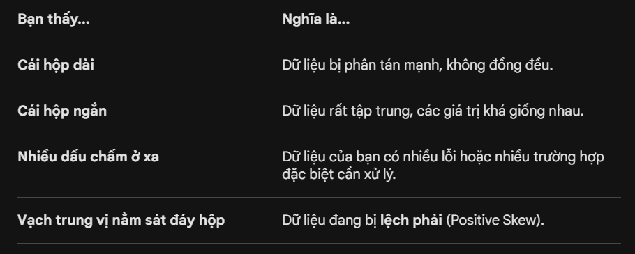

### Độ nhọn (Kurtosis)

Đây là công thức tính độ nhọn (Excess Kurtosis):
$$Kurtosis = \frac{\sum_{i=1}^{n} (X_i - \bar{X})^4 / n}{s^4} - 3$$

- Kurtosis > 0 (Leptokurtic): Đỉnh nhọn hoắt, dữ liệu tập trung cực độ vào trung tâm. Cái này rất tốt để làm "vạch kẻ đường" phát hiện tấn công.

- Kurtosis < 0 (Platykurtic): Đỉnh bẹt dí, dữ liệu phân tán đều ra hai bên, không có trọng tâm rõ ràng.

### Độ mất cân bằng (Imbalanced):

Kiểm tra bằng chỉ số `top_freq_pct` (phần trăm của giá trị xuất hiện nhiều nhất):

- Nếu top_freq_pct tầm 50-60%: Dữ liệu khá cân bằng.

- Nếu top_freq_pct vọt lên > 90%: Cảnh báo đỏ! AI của bạn sẽ gần như chỉ học về giá trị đó và lờ đi các giá trị khác.

### Độ xiên (Skewness)

Chỉ số skew giúp bạn biết dữ liệu có bị lệch về một bên không:

- Từ -0.5 đến 0.5: Dữ liệu khá đối xứng (rất đẹp).
- Từ -1 đến -0.5 hoặc 0.5 đến 1: Lệch vừa vừa.
- Nhỏ hơn -1 hoặc Lớn hơn 1: Lệch rất cao.

#### Kí hiệu **e**

- **e-** (e kèm dấu trừ): Nghĩa là dời dấu phẩy sang trái. Số đằng sau dấu trừ càng lớn thì số thực tế càng nhỏ (rất gần số 0).
  - Ví dụ _1.389...e-16_. Bạn dời dấu phẩy sang trái 16 lần, nó sẽ thành: 0.000000000000000138. Tức là gần như bằng 0.

  - Ví dụ _-2.543...e-01_: Dời dấu phẩy sang trái 1 lần, nó thành: -0.254.

- **e+** (e kèm dấu cộng): Nghĩa là dời dấu phẩy sang phải.

  Ví dụ _4.379...e+00_, dịch ra đơn giản là 4.379.

### Boxplot - "Máy dò" Outliers

Nhìn vào biểu đồ Boxplot, những dấu chấm nằm ngoài "râu" của biểu đồ chính là các giá trị ngoại lai. Đây là những điểm dữ liệu "dị" có thể làm sai lệch kết quả mô hình máy học của bạn.

Để vẽ được một cái Boxplot, máy tính luôn phải đi tìm 5 chỉ số thống kê quan trọng sau (đã được sắp xếp từ nhỏ đến lớn):

- Min: Giá trị nhỏ nhất không phải là ngoại lai.
- Q1 (Tứ phân vị thứ nhất / 25%): Có 25% dữ liệu nhỏ hơn mức này.
- Median (Trung vị / 50%): Con số nằm chính giữa tập dữ liệu.
- Q3 (Tứ phân vị thứ ba / 75%): Có 75% dữ liệu nhỏ hơn mức này.
- Max: Giá trị lớn nhất không phải là ngoại lai.

Quy tắc vẽ cái "Hộp" (The Box):

- Cạnh dưới của hộp: Là Q1.
- Cạnh trên của hộp: Là Q3.
- Chiều cao của hộp: Được gọi là IQR (Interquartile Range - Khoảng cách tứ phân vị). Đây là nơi chứa 50% lượng dữ liệu tập trung nhất của bạn.
- Vạch ngang ở giữa: Chính là Median.

Quy tắc vẽ cái "Râu" (The Whiskers):

- Râu trên (Upper Whisker): Kéo dài từ $Q3$ đến giá trị lớn nhất nằm trong khoảng:$$Limit_{Upper} = Q3 + (1.5 \times IQR)$$
- Râu dưới (Lower Whisker): Kéo dài từ $Q1$ xuống đến giá trị nhỏ nhất nằm trong khoảng:$$Limit_{Lower} = Q1 - (1.5 \times IQR)$$
- Bất kỳ con số nào "văng" ra ngoài hai cái giới hạn (Limit) trên sẽ được coi là giá trị ngoại lai (**Outliners**) và được biểu diễn bằng các dấu chấm riêng lẻ.

#### Tóm lại là

#### Cách xử lý Outliners

- **Log Transformation** (Biến đổi Logarit)
  - Đây là "bài tủ" để trị các dữ liệu bị lệch phải. Bằng cách áp dụng hàm logarit toán học (thường là x = log(x+1) để tránh lỗi với số 0), bạn sẽ "kéo" các giá trị khổng lồ sát lại gần với phần đông dữ liệu hơn.

  - Tác dụng: Hình dáng dữ liệu sẽ trở nên cân đối hơn (gần với phân phối chuẩn), giúp các mô hình Machine Learning dễ dàng nắm bắt quy luật mà không làm mất đi thông tin gốc.

- **Winsorization** (Kỹ thuật cắt chóp)
  - Thao tác này giống như việc bạn thiết lập một mức "kịch trần" (hoặc kịch sàn) cho dữ liệu. Bạn sẽ chọn một ngưỡng (thường là bách phân vị thứ 95 hoặc 99 - P99) và thay thế mọi giá trị lớn hơn ngưỡng đó bằng đúng giá trị tại ngưỡng.

  - Ví dụ: Giả sử P99 của cột RTT là 300ms. Dùng Winsorization, bất kỳ request nào có RTT là 5000ms hay 10000ms đều sẽ được ghi lại là 3000ms.Tác dụng: Hạn chế sức ảnh hưởng quá đà của vài điểm siêu dị biệt lên thuật toán, đồng thời vẫn giữ được thông điệp: "đây là một nhóm request có tốc độ rất chậm".

**Lưu ý**: Nếu làm việc với Tree-based Model, không cần quan tâm Outliner!

### Heatmap - "Tơ duyên" giữa các biến

Ma trận tương quan (Heatmap) giúp bạn biết hai biến có "đi cùng nhau" không.

#### Vấn đề Đa cộng tuyến (Multicollinearity)

Nếu 2 biến có độ tương quan **cực cao** (sát 1 hoặc -1), có thể xem xét lọc bớt 1 biến để giúp giảm độ nhiễu và tối ưu thời gian huấn luyện mà không làm suy giảm lượng thông tin của tập dữ liệu.

Dưới đây là thang đo phổ biến nhất để phân loại "tình trạng mối quan hệ" giữa các biến:

- 0.0 - 0.3: Tương quan yếu hoặc không có.

- 0.3 - 0.5: Tương quan yếu đến vừa.

- 0.5 - 0.7: Tương quan vừa đến khá.

- 0.7 - 0.9: Tương quan CAO. Đạt đến mốc này là bạn đã phải bắt đầu đưa các biến vào tầm ngắm rồi.

- \> 0.9: Tương quan RẤT CAO. Đây chính là mức báo động đỏ của hiện tượng đa cộng tuyến.

Nếu đôi khi nhìn Heatmap bằng mắt thường dễ bị hoa mắt, hoặc hệ số cứ lấp lửng ở ngưỡng 0.7 - 0.8 khiến bạn phân vân có nên xóa hay không, hãy dùng một công cụ mạnh tay hơn là chỉ số **VIF (Variance Inflation Factor)**. Thay vì chỉ so sánh từng cặp đôi với nhau như Heatmap, VIF sẽ xét độ tương quan của một biến với toàn bộ các biến còn lại trong tập dữ liệu.

- VIF < 5: Dữ liệu khỏe, không có đa cộng tuyến đáng kể.

- VIF từ 5 đến 10: Bắt đầu có đa cộng tuyến (cần theo dõi).

- VIF > 10: Đa cộng tuyến rất cao. Chắc chắn phải xử lý (thường là drop bớt biến hoặc dùng các kỹ thuật giảm chiều dữ liệu như PCA).

### Univariate Analysis (Phân tích đơn biến)

Việc kết hợp Histogram (biểu đồ cột) và KDE (đường cong) giúp bạn thấy rõ hình hài của dữ liệu có tuân theo quy luật phân phối chuẩn hay không.

#### Đọc Histogram & KDE (Phân phối đơn biến) - Đám đông đang ở đâu?

- **Histogram** (Biểu đồ cột liền nhau):

  Nó chặt dữ liệu của bạn thành các "khúc" (bins). Cột nào càng cao, chứng tỏ càng có nhiều người/vật rơi vào khoảng giá trị đó.

  Ví dụ: Cột lương. Cột ở mốc 10-15 triệu cao chót vót, nghĩa là đa số mọi người trong công ty nhận mức lương này.

- **KDE** (Cái đường cong mềm mại):

  Nó vẽ uốn lượn ôm theo các đỉnh của cột Histogram để tạo thành một "đỉnh núi". Nhìn vào đường này dễ hơn nhìn các cột cứng nhắc.

- Cách đọc cái "đỉnh núi" này:
  - Núi nằm chính giữa, hai bên cân xứng (Phân phối chuẩn - Normal Distribution): Giống hệt cái chuông. Dữ liệu cực đẹp, đa số tập trung ở giữa, số ít quá cao hoặc quá thấp. (Skew ≈ 0).

  - Đỉnh núi lệch sang TRÁI, cái đuôi kéo lê thê sang PHẢI (Lệch phải - Positive Skew): Đa số dữ liệu nằm ở mức thấp, nhưng có vài phần tử "đột biến" kéo dài về phía giá trị khổng lồ.

  - Đỉnh núi lệch sang PHẢI, cái đuôi kéo lê thê sang TRÁI (Lệch trái - Negative Skew): Đa số dữ liệu có giá trị cao, nhưng lác đác có vài phần tử có giá trị cực thấp.
